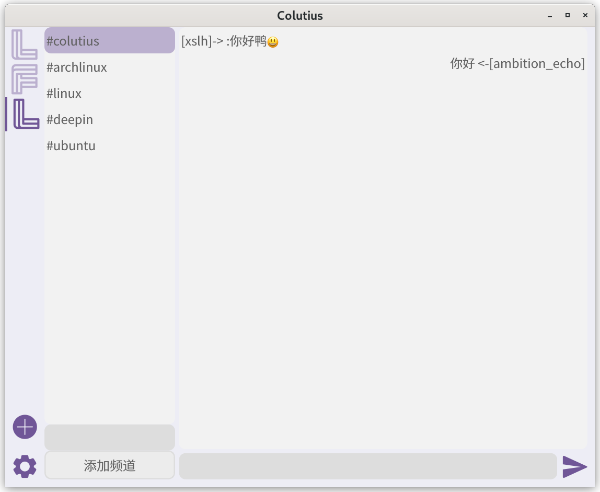

# Colutius


[[中文](https://github.com/colutius/colutius#colutius)]

### Welcome to the

```c++
   _____      _       _   _           
  / ____|    | |     | | (_)          
 | |     ___ | |_   _| |_ _ _   _ ___ 
 | |    / _ \| | | | | __| | | | / __|
 | |___| (_) | | |_| | |_| | |_| \__ \
  \_____\___/|_|\__,_|\__|_|\__,_|___/
  
  qDebug() << "Hello Colutius!";
```
### A cross-platform, easy-to-use, beautiful IRC client
## Screenshot


## Automate builds

|[Linux][linux-link]|[Windows][windows-link]|[MacOS][macos-link]|[Backup][backup-link]|
|-------------------|-----------------------|-------------------|-------------------|
|![linux-badge] |![windows-badge] |![macos-badge] |![backup-badge] |

|[License][license-link]| [Release][release-link]| [Download][download-link] | [Stars][stars-link] |
|-------------------|-----------------------|-------------------|------------|
|![license-badge] |![release-badge] |![download-badge] |![stars-badge] |

## Build manually
- Clone the repository
```bash
git clone https://github.com/colutius/colutius.git
cd colutius
```
- Start build
```bash
mkdir build
cd build
cmake ..
make
```
- Run the program
```bash
./colutius
```


[windows-link]: https://github.com/colutius/colutius/actions/workflows/Windows.yml
[windows-badge]: https://github.com/colutius/colutius/actions/workflows/Windows.yml/badge.svg

[linux-link]: https://github.com/colutius/colutius/actions/workflows/Linux.yml
[linux-badge]: https://github.com/colutius/colutius/actions/workflows/Linux.yml/badge.svg

[macos-link]: https://github.com/colutius/colutius/actions/workflows/MacOS.yml
[macos-badge]: https://github.com/colutius/colutius/actions/workflows/MacOS.yml/badge.svg

[backup-link]: https://github.com/colutius/colutius/actions/workflows/backup.yml
[backup-badge]: https://github.com/colutius/colutius/actions/workflows/backup.yml/badge.svg

[release-link]: https://github.com/colutius/colutius/releases
[release-badge]: https://img.shields.io/github/v/release/colutius/colutius

[license-link]: https://github.com/colutius/colutius/blob/master/LICENSE
[license-badge]: https://img.shields.io/github/license/colutius/colutius

[download-link]: https://github.com/colutius/colutius/releases
[download-badge]: https://img.shields.io/github/downloads/colutius/colutius/total
[stars-link]: https://github.com/colutius/colutius
[stars-badge]: https://img.shields.io/github/stars/colutius/colutius
